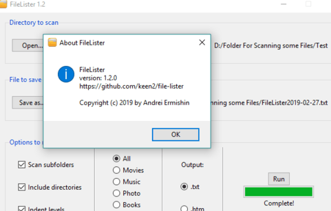
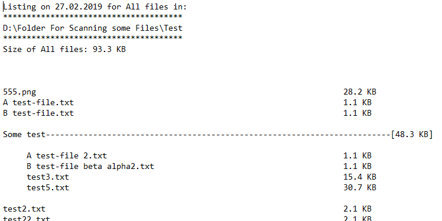
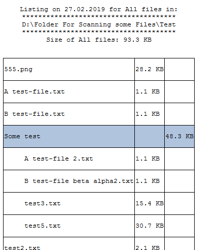

# FileLister

Scans for files and subfolders in a directory and writes to
file a list of data structured by hierarchy.

<p align="center">
  
</p>
<br></br>
<p><b>Txt:</b>
  
  <b>Html:</b>
  
</p>


## Usage

GUI version if no arguments given, console otherwise:
```
file-lister.py [-h] [-f FILEPATH] [-s] [-d] [-i] dirpath

Print list of files of a given directory.

positional arguments:
  dirpath               Directory path to scan

optional arguments:
  -h, --help            show this help message and exit
  -f FILEPATH, --filepath FILEPATH
                        File path to save scanning results
  -s, --subdirs         Disable subdirectories scanning
  -d, --includedirs     Disable of printing directory info
  -i, --indent          Disable depth indentation
```

## Authors

**Andrei Ermishin**

## License


See [LICENSE](LICENSE) for more information.

Copyright 2019 © Andrei Ermishin
